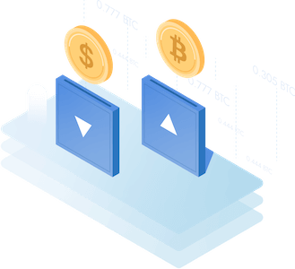

# Coin Conversion



## **Requerimentos**

- PHP v8.
- GIT v2
- Composer v2.
- Banco de dados: MySql, SQlite, PostgreSQL, SQLServer.

## Descrição
Esse software tem o intuito de fazer a conversão de moedas pré cadastradas, épossível informar a quantidade também.

Para instalar e testar o projeto siga os passos a seguir:

### Moedas disponiveis para conversão

| Moeda | Código |
|--------|--------|
| BRL | Real Brasileiro |
| USD | Dólar Americano |
| ARS | Peso Argentino |
| EUR | Euro |
| GBP | Libra |
| BTC | Bitcoin |

## Instalação

#### Clonando o projeto.
```shell
git clone git@github.com:SOSTheBlack/bildvitta.git
```

#### Acesse a pasta do projeto.
```shell
cd bildvitta
```

#### Instale as dependências.
```shell
composer install
```

#### Gere a chave de segurança do software.
```shell
php artisan key:generate
```

#### Criar arquivo de configuração.
Execute o comando abaixo para criar o seu aquivo `.env`.
```shell
cp .env.example .env
```
Após a criação do seu `.env` edite as suas configuração de banco de dados para proceguirmos ao próximo passo.

#### Criando as tabelas no banco de dados.
```shell
php artisan migrate
```
Nesse momento está sendo criado a tabela que irá conter as moedas disponiveis para conversão.

#### Cadastrando as moedas que estarão disponíveis para conversão.
```shell
php artisan db:seed
```
As moedas para conversão estão na tabela `coin_conversions`.

#### Inicializando o software.
```shell
php artisan serve
```

## Utilização

Para utilizar a API, segue esse cURL de exemplo.
Atenção a porta que está sendo rodado o software em seu sistema.

```
curl -L -X GET "http://127.0.0.1:8000/api/coins/conversions?coin_from=USD&coin_to=GBP&quantity=10" \
-H 'Content-Type: application/json' \
-H 'Accept: application/json' \
-H 'Token: d812b49499b6b3e6b24a70cece02f2f7'
```

O endpoint da API é um *GET* e os paramatros deve ser enviado por *query string*.

### Parâmetros da API

Segue os paramtros de nossa API.

#### Query String


| Key | Obrigatório | Descrição |
|-----|-------------|-----------|
| coin_from | SIM | Moeda de origen(De) |
| coin_to | SIM | Modera de destino(Para) |
| quantity | SIM | Qauntidade de moedas a serem convertidas |

#### Headers
| Key | Value | Obrigatório | Descrição |
|-----|-------|------|-----------|
| Token | config('services.api.token') | SIM | Qauntidade de moedas a serem convertidas |
| Accept | application/json | NÃO | Tipo de conteúdo enviado a API |
| Content-Type | application/json | NÃO | Tipo de conteúdo retornado da API |

### Resposta da API

#### 200 - Sucesso
Exemplo de response segundo o cURL anexado acima.

```json
{
    "data": {
        "coin_from": "USD",
        "coin_to": "GBP",
        "quantity": 10,
        "price": 7.8
    }
}
```

#### 422 - Unprocessable Entity
```json
{
    "message": "The given data was invalid.",
    "errors": {
        "quantity": [
            "The quantity field is required."
        ],
        "coin_from": [
            "The coin from field is required."
        ],
        "coin_to": [
            "The coin to field is required."
        ]
    }
}
```

#### 401 - Unauthorized

Ausência do header `Token`.
```json
{
    "message": "missing token, is has required"
}
```

Token inválido
```json
{
    "message": "invalid token"
}
```

## Erros do Software

#### \App\Exceptions\Api\TokenException
| Código | Mensagem |
|----|----|
| 1001 | missing token, is has required. |
| 1002 | invalid token. |

#### \App\Exceptions\Repositories\ModelNotFoundException
| Código | Mensagem |
|----|----|
| 1001 | no results for model. |

#### \App\Exceptions\Repositories\QueryException
| Código | Mensagem |
|----|----|
| 1001 | error when inserting database. |

## Rodando testes

Execute o comando abaixo:

```shell
php artisan test
```

Você deve visualizar algo semelhante a isso:

```shell
   PASS  Tests\Feature\Api\Coins\ConversionTest
  ✓ coin conversion with success
  ✓ coin conversion with success with data set #1
  ✓ coin conversion with success with data set #2
  ✓ coin conversion with success with data set #3
  ✓ coin conversion with success with data set #4
  ✓ coin conversion with success with data set #5
  ✓ coin conversion with success with data set #6
  ✓ coin conversion with success with data set #7
  ✓ coin conversion with success with data set #8
  ✓ coin conversion with success with data set #9
  ✓ coin conversion with success with data set #10
  ✓ has validation inputs
  ✓ has validation inputs with data set #1
  ✓ has validation inputs with data set #2
  ✓ has validation inputs with data set #3
  ✓ has validation inputs with data set #4
  ✓ has validation inputs with data set #5
  ✓ has validation inputs with data set #6
  ✓ if coin exists in database
  ✓ if coin exists in database with data set #1
  ✓ if coin exists in database with data set #2
  ✓ if coin exists in database with data set #3
  ✓ if coin exists in database with data set #4
  ✓ if coin exists in database with data set #5
  ✓ if coin exists in database with data set #6
  ✓ if coin exists in database with data set #7
  ✓ if coin exists in database with data set #8
  ✓ if coin exists in database with data set #9
  ✓ if coin exists in database with data set #10
  ✓ if coin exists in database with data set #11
  ✓ if coin exists in database with data set #12
  ✓ if coin exists in database with data set #13
  ✓ if coin exists in database with data set #14
  ✓ if coin exists in database with data set #15
  ✓ if coin exists in database with data set #16
  ✓ if coin exists in database with data set #17
  ✓ if coin exists in database with data set #18
  ✓ if coin exists in database with data set #19
  ✓ if coin exists in database with data set #20
  ✓ if coin exists in database with data set #21
```
